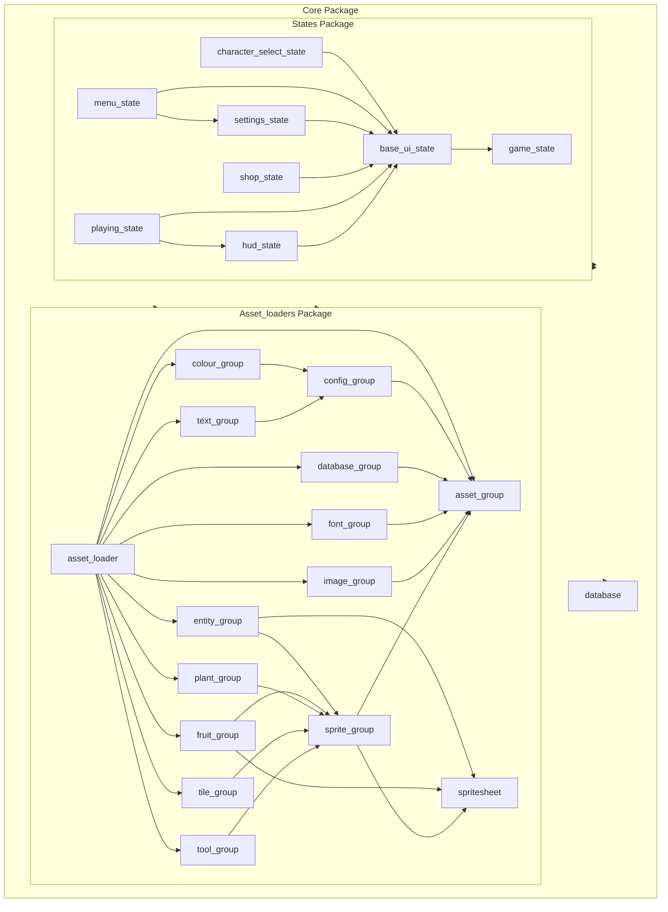

```mermaid
flowchart TB
    direction TB

    subgraph core [Core Package]
        database
        subgraph asset_loaders [Asset_loaders Package]
            asset_group
            asset_loader
            colour_group
            config_group
            database_group
            entity_group
            font_group
            fruit_group
            image_group
            plant_group
            sprite_group
            spritesheet
            text_group
            tile_group
            tool_group
        end
        subgraph states [States Package]
            base_ui_state
            character_select_state
            game_state
            hud_state
            menu_state
            playing_state
            settings_state
            shop_state
        end
    end

    %% Structural & Dependency Links
    core --> asset_loaders
    core --> asset_loaders
    core --> database
    core --> states
    core --> states
    asset_loader --> asset_group
    asset_loader --> colour_group
    asset_loader --> database_group
    asset_loader --> entity_group
    asset_loader --> font_group
    asset_loader --> fruit_group
    asset_loader --> image_group
    asset_loader --> plant_group
    asset_loader --> text_group
    asset_loader --> tile_group
    asset_loader --> tool_group
    base_ui_state --> game_state
    character_select_state --> base_ui_state
    colour_group --> config_group
    config_group --> asset_group
    database_group --> asset_group
    entity_group --> sprite_group
    entity_group --> spritesheet
    font_group --> asset_group
    fruit_group --> sprite_group
    fruit_group --> spritesheet
    hud_state --> base_ui_state
    image_group --> asset_group
    menu_state --> base_ui_state
    menu_state --> settings_state
    plant_group --> sprite_group
    playing_state --> base_ui_state
    playing_state --> hud_state
    settings_state --> base_ui_state
    shop_state --> base_ui_state
    sprite_group --> asset_group
    sprite_group --> spritesheet
    text_group --> config_group
    tile_group --> sprite_group
    tool_group --> sprite_group
```
