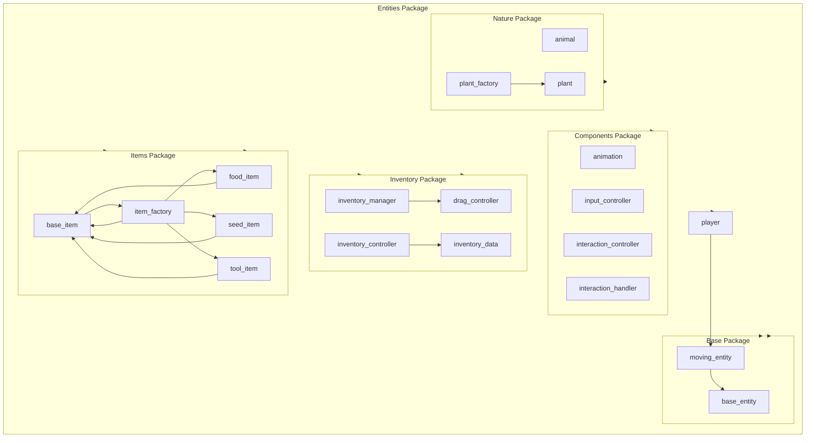

```mermaid
flowchart TB
    direction TB

    subgraph entities [Entities Package]
        player
        subgraph base [Base Package]
            base_entity
            moving_entity
        end
        subgraph components [Components Package]
            animation
            input_controller
            interaction_controller
            interaction_handler
        end
        subgraph inventory [Inventory Package]
            drag_controller
            inventory_controller
            inventory_data
            inventory_manager
        end
        subgraph items [Items Package]
            base_item
            food_item
            item_factory
            seed_item
            tool_item
        end
        subgraph nature [Nature Package]
            animal
            plant
            plant_factory
        end
    end

    %% Structural & Dependency Links
    entities --> base
    entities --> base
    entities --> components
    entities --> components
    entities --> inventory
    entities --> inventory
    entities --> items
    entities --> items
    entities --> nature
    entities --> nature
    entities --> player
    base_item --> item_factory
    food_item --> base_item
    inventory_controller --> inventory_data
    inventory_manager --> drag_controller
    item_factory --> base_item
    item_factory --> food_item
    item_factory --> seed_item
    item_factory --> tool_item
    moving_entity --> base_entity
    plant_factory --> plant
    player --> moving_entity
    seed_item --> base_item
    tool_item --> base_item
```
