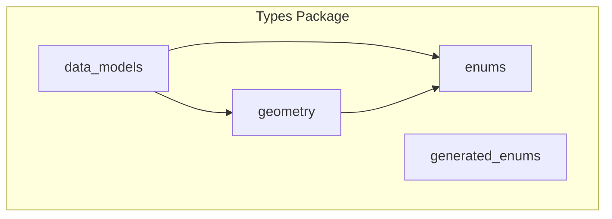

```mermaid
flowchart TB
    direction TB

    subgraph types [Types Package]
        data_models
        enums
        generated_enums
        geometry
    end

    %% Structural & Dependency Links
    data_models --> enums
    data_models --> geometry
    geometry --> enums
```
