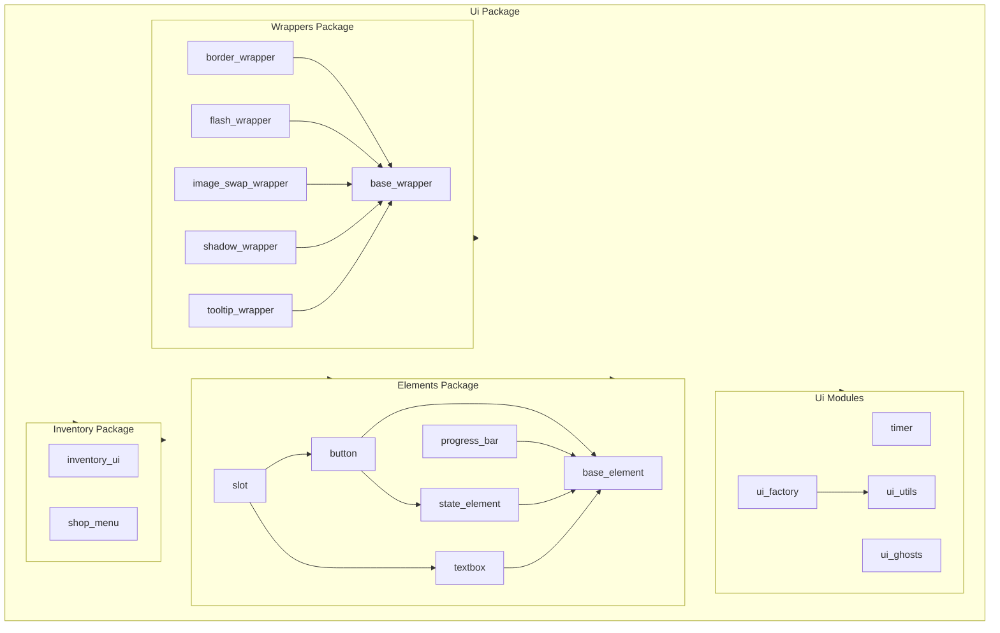

```mermaid
flowchart TB
    direction TB

    subgraph ui [Ui Package]
        subgraph ui_files [Ui Modules]
            timer
            ui_factory
            ui_ghosts
            ui_utils
        end
        subgraph elements [Elements Package]
            base_element
            button
            progress_bar
            slot
            state_element
            textbox
        end
        subgraph inventory [Inventory Package]
            inventory_ui
            shop_menu
        end
        subgraph wrappers [Wrappers Package]
            base_wrapper
            border_wrapper
            flash_wrapper
            image_swap_wrapper
            shadow_wrapper
            tooltip_wrapper
        end
    end

    %% Structural & Dependency Links
    ui --> elements
    ui --> elements
    ui --> inventory
    ui --> inventory
    ui --> ui_files
    ui --> wrappers
    ui --> wrappers
    border_wrapper --> base_wrapper
    button --> base_element
    button --> state_element
    flash_wrapper --> base_wrapper
    image_swap_wrapper --> base_wrapper
    progress_bar --> base_element
    shadow_wrapper --> base_wrapper
    slot --> button
    slot --> textbox
    state_element --> base_element
    textbox --> base_element
    tooltip_wrapper --> base_wrapper
    ui_factory --> ui_utils
```
