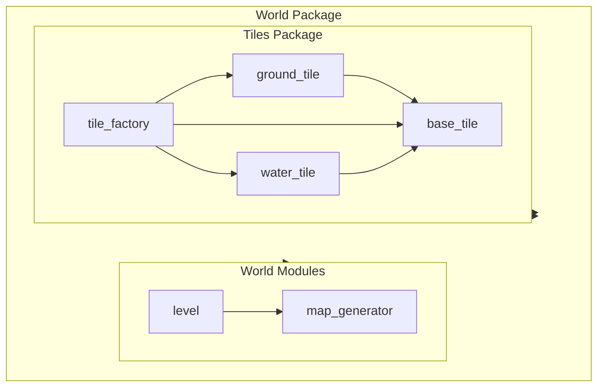

```mermaid
flowchart TB
    direction TB

    subgraph world [World Package]
        subgraph world_files [World Modules]
            level
            map_generator
        end
        subgraph tiles [Tiles Package]
            base_tile
            ground_tile
            tile_factory
            water_tile
        end
    end

    %% Structural & Dependency Links
    world --> tiles
    world --> tiles
    world --> world_files
    ground_tile --> base_tile
    level --> map_generator
    tile_factory --> base_tile
    tile_factory --> ground_tile
    tile_factory --> water_tile
    water_tile --> base_tile
```
