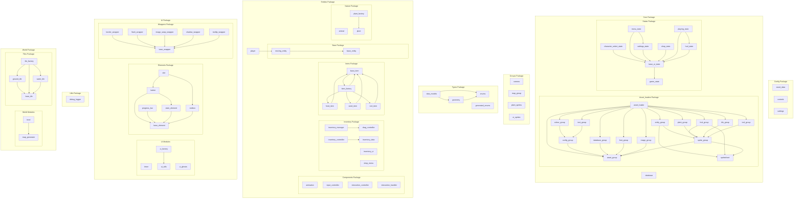

```mermaid
flowchart TB
    direction TB

    subgraph config [Config Package]
        asset_data
        controls
        settings
    end
    subgraph core [Core Package]
        database
        subgraph asset_loaders [Asset_loaders Package]
            asset_group
            asset_loader
            colour_group
            config_group
            database_group
            entity_group
            font_group
            fruit_group
            image_group
            plant_group
            sprite_group
            spritesheet
            text_group
            tile_group
            tool_group
        end
        subgraph states [States Package]
            base_ui_state
            character_select_state
            game_state
            hud_state
            menu_state
            playing_state
            settings_state
            shop_state
        end
    end
    subgraph entities [Entities Package]
        player
        subgraph base [Base Package]
            base_entity
            moving_entity
        end
        subgraph components [Components Package]
            animation
            input_controller
            interaction_controller
            interaction_handler
        end
        subgraph inventory [Inventory Package]
            drag_controller
            inventory_controller
            inventory_data
            inventory_manager
        end
        subgraph items [Items Package]
            base_item
            food_item
            item_factory
            seed_item
            tool_item
        end
        subgraph nature [Nature Package]
            animal
            plant
            plant_factory
        end
    end
    subgraph groups [Groups Package]
        camera
        map_group
        plant_sprites
        ui_sprites
    end
    subgraph types [Types Package]
        data_models
        enums
        generated_enums
        geometry
    end
    subgraph ui [Ui Package]
        subgraph ui_files [Ui Modules]
            timer
            ui_factory
            ui_ghosts
            ui_utils
        end
        subgraph elements [Elements Package]
            base_element
            button
            progress_bar
            slot
            state_element
            textbox
        end
        subgraph inventory [Inventory Package]
            inventory_ui
            shop_menu
        end
        subgraph wrappers [Wrappers Package]
            base_wrapper
            border_wrapper
            flash_wrapper
            image_swap_wrapper
            shadow_wrapper
            tooltip_wrapper
        end
    end
    subgraph utils [Utils Package]
        debug_logger
    end
    subgraph world [World Package]
        subgraph world_files [World Modules]
            level
            map_generator
        end
        subgraph tiles [Tiles Package]
            base_tile
            ground_tile
            tile_factory
            water_tile
        end
    end

    %% Package Dependency Links
    asset_loader --> asset_group
    asset_loader --> colour_group
    asset_loader --> database_group
    asset_loader --> entity_group
    asset_loader --> font_group
    asset_loader --> fruit_group
    asset_loader --> image_group
    asset_loader --> plant_group
    asset_loader --> text_group
    asset_loader --> tile_group
    asset_loader --> tool_group
    base_item --> item_factory
    base_ui_state --> game_state
    border_wrapper --> base_wrapper
    button --> base_element
    button --> state_element
    character_select_state --> base_ui_state
    colour_group --> config_group
    config_group --> asset_group
    data_models --> enums
    data_models --> geometry
    database_group --> asset_group
    entity_group --> sprite_group
    entity_group --> spritesheet
    flash_wrapper --> base_wrapper
    font_group --> asset_group
    food_item --> base_item
    fruit_group --> sprite_group
    fruit_group --> spritesheet
    geometry --> enums
    ground_tile --> base_tile
    hud_state --> base_ui_state
    image_group --> asset_group
    image_swap_wrapper --> base_wrapper
    inventory_controller --> inventory_data
    inventory_manager --> drag_controller
    item_factory --> base_item
    item_factory --> food_item
    item_factory --> seed_item
    item_factory --> tool_item
    level --> map_generator
    menu_state --> base_ui_state
    menu_state --> settings_state
    moving_entity --> base_entity
    plant_factory --> plant
    plant_group --> sprite_group
    player --> moving_entity
    playing_state --> base_ui_state
    playing_state --> hud_state
    progress_bar --> base_element
    seed_item --> base_item
    settings_state --> base_ui_state
    shadow_wrapper --> base_wrapper
    shop_state --> base_ui_state
    slot --> button
    slot --> textbox
    sprite_group --> asset_group
    sprite_group --> spritesheet
    state_element --> base_element
    text_group --> config_group
    textbox --> base_element
    tile_factory --> base_tile
    tile_factory --> ground_tile
    tile_factory --> water_tile
    tile_group --> sprite_group
    tool_group --> sprite_group
    tool_item --> base_item
    tooltip_wrapper --> base_wrapper
    ui_factory --> ui_utils
    water_tile --> base_tile
```
