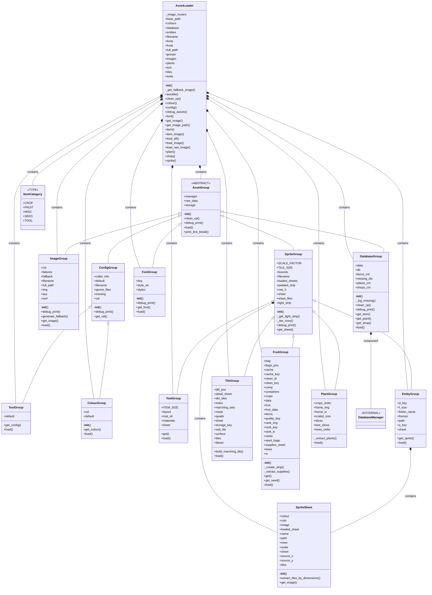

```mermaid
classDiagram
    ConfigGroup <|-- TextGroup
    ConfigGroup <|-- ColourGroup
    AssetGroup <|-- ImageGroup
    AssetGroup <|-- ConfigGroup
    AssetGroup <|-- SpriteGroup
    SpriteGroup <|-- ToolGroup
    AssetGroup <|-- DatabaseGroup
    SpriteGroup <|-- EntityGroup
    SpriteGroup <|-- TileGroup
    SpriteGroup <|-- FruitGroup
    AssetGroup <|-- FontGroup
    SpriteGroup <|-- PlantGroup
    EntityGroup *-- SpriteSheet : contains
    SpriteGroup *-- SpriteSheet : contains
    AssetLoader *-- AssetGroup : contains
    AssetLoader *-- DatabaseGroup : contains
    AssetLoader *-- EntityGroup : contains
    AssetLoader *-- ColourGroup : contains
    AssetLoader *-- ImageGroup : contains
    AssetLoader *-- TileGroup : contains
    AssetLoader *-- PlantGroup : contains
    AssetLoader *-- TextGroup : contains
    AssetLoader *-- ToolGroup : contains
    DatabaseGroup *-- DatabaseManager : component
    AssetLoader *-- ItemCategory : contains
    AssetLoader *-- FruitGroup : contains
    AssetLoader *-- FontGroup : contains
    class DatabaseManager {
        <<EXTERNAL>>
    }
    class ItemCategory {
        <<TYPE>>
        +CROP
        +FRUIT
        +MISC
        +SEED
        +TOOL
    }
    class TextGroup {
        +default
        +get_config()
        +load()
    }
    class AssetGroup {
        <<ABSTRACT>>
        +manager
        +raw_data
        +storage
        -__init__()
        +clean_up()
        +debug_print()
        +load()
        +print_line_break()
    }
    class ColourGroup {
        +col
        +default
        -__init__()
        +get_colour()
        +load()
    }
    class ImageGroup {
        +col
        +failures
        +fallback
        +filename
        +full_path
        +img
        +key
        +surf
        -__init__()
        +debug_print()
        +generate_fallback()
        +get_image()
        +load()
    }
    class ConfigGroup {
        +caller_info
        +default
        +filename
        +ignore_files
        +missing
        +val
        -__init__()
        +debug_print()
        +get_val()
    }
    class AssetLoader {
        -_image_routers
        +base_path
        +colours
        +database
        +entities
        +filename
        +fonts
        +fruits
        +full_path
        +groups
        +images
        +plants
        +text
        +tiles
        +tools
        -__init__()
        -_get_fallback_image()
        +autotile()
        +clean_up()
        +colour()
        +config()
        +debug_assets()
        +font()
        +get_image()
        +get_image_path()
        +item()
        +item_image()
        +load_all()
        +load_image()
        +load_raw_image()
        +plant()
        +shop()
        +sprite()
    }
    class SpriteGroup {
        +SCALE_FACTOR
        +TILE_SIZE
        +bounds
        +filename
        +loaded_sheets
        +padded_strip
        +row_h
        +sheet
        +sheet_files
        +tight_strip
        -__init__()
        -_get_tight_strip()
        -_iter_rows()
        +debug_print()
        +get_sheet()
    }
    class SpriteSheet {
        +colour
        +cols
        +image
        +loaded_sheet
        +name
        +path
        +rows
        +scale
        +sheet
        +source_x
        +source_y
        +tiles
        -__init__()
        +extract_tiles_by_dimensions()
        +get_image()
    }
    class ToolGroup {
        +ITEM_SIZE
        +layout
        +mat_str
        +materials
        +sheet
        +get()
        +load()
    }
    class DatabaseGroup {
        +data
        +db
        +items_cnt
        +missing_ids
        +plants_cnt
        +shops_cnt
        -__init__()
        -_log_missing()
        +clean_up()
        +debug_print()
        +get_item()
        +get_plant()
        +get_shop()
        +load()
    }
    class EntityGroup {
        +d_key
        +f_size
        +folder_name
        +frames
        +path
        +s_key
        +sheet
        +get_sprite()
        +load()
    }
    class TileGroup {
        +blit_pos
        +detail_sheet
        +dirt_tiles
        +index
        +marching_sets
        +mask
        +quads
        +sheet
        +storage_key
        +sub_tile
        +surface
        +tiles
        +tileset
        +build_marching_tile()
        +load()
    }
    class FruitGroup {
        +bag
        +bags_pos
        +cache
        +cache_key
        +clean_id
        +clean_key
        +comp
        +containers
        +crops
        +data
        +fruit
        +fruit_data
        +items
        +quality_key
        +rank_img
        +rank_key
        +rank_w
        +ranks
        +seed_bags
        +supplies_sheet
        +trees
        +w
        -__init__()
        -_create_strip()
        -_extract_supplies()
        +get()
        +get_seed()
        +load()
    }
    class FontGroup {
        +key
        +style_str
        +styles
        -__init__()
        +debug_print()
        +get_font()
        +load()
    }
    class PlantGroup {
        +crops_order
        +frame_img
        +frame_w
        +scaled_size
        +slices
        +tree_slices
        +trees_order
        -_extract_plants()
        +load()
    }
```