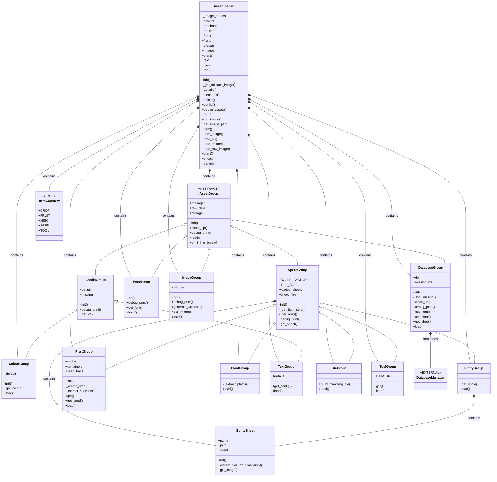

```mermaid
classDiagram
    ConfigGroup <|-- ColourGroup
    AssetGroup <|-- ConfigGroup
    AssetGroup <|-- DatabaseGroup
    SpriteGroup <|-- EntityGroup
    AssetGroup <|-- FontGroup
    SpriteGroup <|-- FruitGroup
    AssetGroup <|-- ImageGroup
    SpriteGroup <|-- PlantGroup
    AssetGroup <|-- SpriteGroup
    ConfigGroup <|-- TextGroup
    SpriteGroup <|-- TileGroup
    SpriteGroup <|-- ToolGroup
    AssetLoader *-- TileGroup : contains
    AssetLoader *-- ItemCategory : contains
    AssetLoader *-- PlantGroup : contains
    DatabaseGroup *-- DatabaseManager : component
    AssetLoader *-- AssetGroup : contains
    AssetLoader *-- FontGroup : contains
    EntityGroup *-- SpriteSheet : contains
    AssetLoader *-- EntityGroup : contains
    AssetLoader *-- FruitGroup : contains
    AssetLoader *-- ImageGroup : contains
    AssetLoader *-- ToolGroup : contains
    SpriteGroup *-- SpriteSheet : contains
    AssetLoader *-- ColourGroup : contains
    AssetLoader *-- TextGroup : contains
    AssetLoader *-- DatabaseGroup : contains
    class DatabaseManager {
        <<EXTERNAL>>
    }
    class ItemCategory {
        <<TYPE>>
        +CROP
        +FRUIT
        +MISC
        +SEED
        +TOOL
    }
    class AssetGroup {
        <<ABSTRACT>>
        +manager
        +raw_data
        +storage
        -__init__()
        +clean_up()
        +debug_print()
        +load()
        +print_line_break()
    }
    class AssetLoader {
        -_image_routers
        +colours
        +database
        +entities
        +fonts
        +fruits
        +groups
        +images
        +plants
        +text
        +tiles
        +tools
        -__init__()
        -_get_fallback_image()
        +autotile()
        +clean_up()
        +colour()
        +config()
        +debug_assets()
        +font()
        +get_image()
        +get_image_path()
        +item()
        +item_image()
        +load_all()
        +load_image()
        +load_raw_image()
        +plant()
        +shop()
        +sprite()
    }
    class ColourGroup {
        +default
        -__init__()
        +get_colour()
        +load()
    }
    class ConfigGroup {
        +default
        +missing
        -__init__()
        +debug_print()
        +get_val()
    }
    class DatabaseGroup {
        +db
        +missing_ids
        -__init__()
        -_log_missing()
        +clean_up()
        +debug_print()
        +get_item()
        +get_plant()
        +get_shop()
        +load()
    }
    class EntityGroup {
        +get_sprite()
        +load()
    }
    class FontGroup {
        -__init__()
        +debug_print()
        +get_font()
        +load()
    }
    class FruitGroup {
        +cache
        +containers
        +seed_bags
        -__init__()
        -_create_strip()
        -_extract_supplies()
        +get()
        +get_seed()
        +load()
    }
    class ImageGroup {
        +failures
        -__init__()
        +debug_print()
        +generate_fallback()
        +get_image()
        +load()
    }
    class PlantGroup {
        -_extract_plants()
        +load()
    }
    class SpriteSheet {
        +name
        +path
        +sheet
        -__init__()
        +extract_tiles_by_dimensions()
        +get_image()
    }
    class SpriteGroup {
        +SCALE_FACTOR
        +TILE_SIZE
        +loaded_sheets
        +sheet_files
        -__init__()
        -_get_tight_strip()
        -_iter_rows()
        +debug_print()
        +get_sheet()
    }
    class TextGroup {
        +default
        +get_config()
        +load()
    }
    class TileGroup {
        +build_marching_tile()
        +load()
    }
    class ToolGroup {
        +ITEM_SIZE
        +get()
        +load()
    }
```