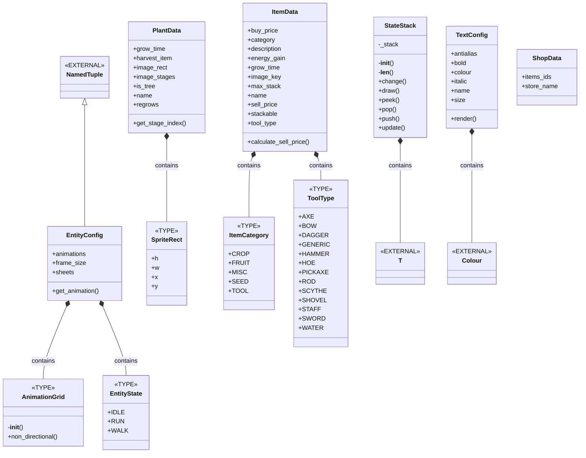

```mermaid
classDiagram
    NamedTuple <|-- EntityConfig
    PlantData *-- SpriteRect : contains
    ItemData *-- ItemCategory : contains
    StateStack *-- T : contains
    ItemData *-- ToolType : contains
    EntityConfig *-- AnimationGrid : contains
    TextConfig *-- Colour : contains
    EntityConfig *-- EntityState : contains
    class AnimationGrid {
        <<TYPE>>
        -__init__()
        +non_directional()
    }
    class Colour {
        <<EXTERNAL>>
    }
    class EntityState {
        <<TYPE>>
        +IDLE
        +RUN
        +WALK
    }
    class ItemCategory {
        <<TYPE>>
        +CROP
        +FRUIT
        +MISC
        +SEED
        +TOOL
    }
    class NamedTuple {
        <<EXTERNAL>>
    }
    class SpriteRect {
        <<TYPE>>
        +h
        +w
        +x
        +y
    }
    class T {
        <<EXTERNAL>>
    }
    class ToolType {
        <<TYPE>>
        +AXE
        +BOW
        +DAGGER
        +GENERIC
        +HAMMER
        +HOE
        +PICKAXE
        +ROD
        +SCYTHE
        +SHOVEL
        +STAFF
        +SWORD
        +WATER
    }
    class EntityConfig {
        +animations
        +frame_size
        +sheets
        +get_animation()
    }
    class ItemData {
        +buy_price
        +category
        +description
        +energy_gain
        +grow_time
        +image_key
        +max_stack
        +name
        +sell_price
        +stackable
        +tool_type
        +calculate_sell_price()
    }
    class PlantData {
        +grow_time
        +harvest_item
        +image_rect
        +image_stages
        +is_tree
        +name
        +regrows
        +get_stage_index()
    }
    class ShopData {
        +items_ids
        +store_name
    }
    class TextConfig {
        +antialias
        +bold
        +colour
        +italic
        +name
        +size
        +render()
    }
    class StateStack {
        -_stack
        -__init__()
        -__len__()
        +change()
        +draw()
        +peek()
        +pop()
        +push()
        +update()
    }
```