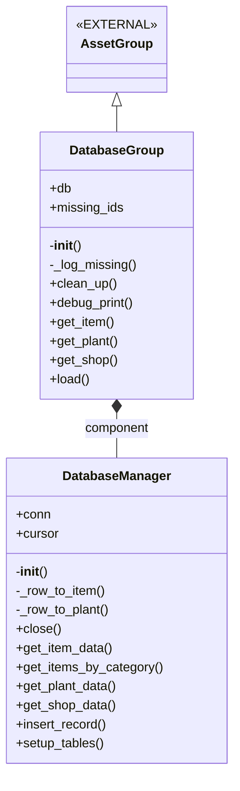

```mermaid
classDiagram
    AssetGroup <|-- DatabaseGroup
    DatabaseGroup *-- DatabaseManager : component
    class AssetGroup {
        <<EXTERNAL>>
    }
    class DatabaseManager {
        +conn
        +cursor
        -__init__()
        -_row_to_item()
        -_row_to_plant()
        +close()
        +get_item_data()
        +get_items_by_category()
        +get_plant_data()
        +get_shop_data()
        +insert_record()
        +setup_tables()
    }
    class DatabaseGroup {
        +db
        +missing_ids
        -__init__()
        -_log_missing()
        +clean_up()
        +debug_print()
        +get_item()
        +get_plant()
        +get_shop()
        +load()
    }
```