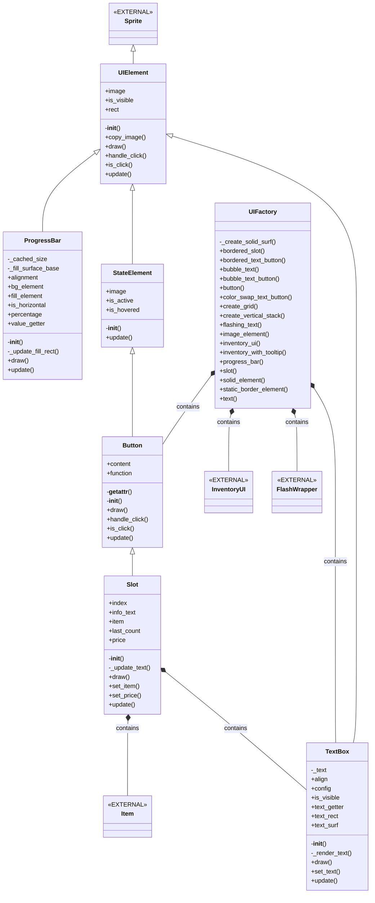

```mermaid
classDiagram
    Sprite <|-- UIElement
    StateElement <|-- Button
    UIElement <|-- ProgressBar
    Button <|-- Slot
    UIElement <|-- StateElement
    UIElement <|-- TextBox
    UIFactory *-- Button : contains
    UIFactory *-- InventoryUI : contains
    UIFactory *-- FlashWrapper : contains
    UIFactory *-- TextBox : contains
    Slot *-- Item : contains
    Slot *-- TextBox : contains
    class FlashWrapper {
        <<EXTERNAL>>
    }
    class InventoryUI {
        <<EXTERNAL>>
    }
    class Item {
        <<EXTERNAL>>
    }
    class Sprite {
        <<EXTERNAL>>
    }
    class UIElement {
        +image
        +is_visible
        +rect
        -__init__()
        +copy_image()
        +draw()
        +handle_click()
        +is_click()
        +update()
    }
    class Button {
        +content
        +function
        -__getattr__()
        -__init__()
        +draw()
        +handle_click()
        +is_click()
        +update()
    }
    class ProgressBar {
        -_cached_size
        -_fill_surface_base
        +alignment
        +bg_element
        +fill_element
        +is_horizontal
        +percentage
        +value_getter
        -__init__()
        -_update_fill_rect()
        +draw()
        +update()
    }
    class Slot {
        +index
        +info_text
        +item
        +last_count
        +price
        -__init__()
        -_update_text()
        +draw()
        +set_item()
        +set_price()
        +update()
    }
    class StateElement {
        +image
        +is_active
        +is_hovered
        -__init__()
        +update()
    }
    class TextBox {
        -_text
        +align
        +config
        +is_visible
        +text_getter
        +text_rect
        +text_surf
        -__init__()
        -_render_text()
        +draw()
        +set_text()
        +update()
    }
    class UIFactory {
        -_create_solid_surf()
        +bordered_slot()
        +bordered_text_button()
        +bubble_text()
        +bubble_text_button()
        +button()
        +color_swap_text_button()
        +create_grid()
        +create_vertical_stack()
        +flashing_text()
        +image_element()
        +inventory_ui()
        +inventory_with_tooltip()
        +progress_bar()
        +slot()
        +solid_element()
        +static_border_element()
        +text()
    }
```