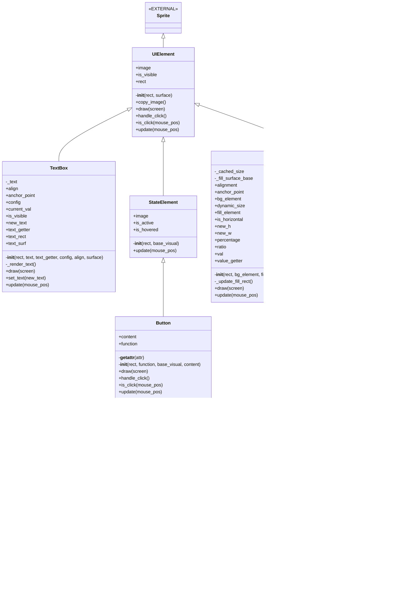

```mermaid
classDiagram
    UIElement <|-- TextBox
    Sprite <|-- UIElement
    UIElement <|-- StateElement
    Button <|-- Slot
    UIElement <|-- ProgressBar
    StateElement <|-- Button
    Slot *-- Item : contains
    class Item {
        <<EXTERNAL>>
    }
    class Sprite {
        <<EXTERNAL>>
    }
    class TextBox {
        -_text
        +align
        +anchor_point
        +config
        +current_val
        +is_visible
        +new_text
        +text_getter
        +text_rect
        +text_surf
        -__init__(rect, text, text_getter, config, align, surface)
        -_render_text()
        +draw(screen)
        +set_text(new_text)
        +update(mouse_pos)
    }
    class UIElement {
        +image
        +is_visible
        +rect
        -__init__(rect, surface)
        +copy_image()
        +draw(screen)
        +handle_click()
        +is_click(mouse_pos)
        +update(mouse_pos)
    }
    class StateElement {
        +image
        +is_active
        +is_hovered
        -__init__(rect, base_visual)
        +update(mouse_pos)
    }
    class Slot {
        +current_count
        +index
        +info_text
        +item
        +item_rect
        +last_count
        +price
        -__init__(rect, index, base_visual)
        -_update_text()
        +draw(screen)
        +set_item(item)
        +set_price(price)
        +update(mouse_pos)
    }
    class ProgressBar {
        -_cached_size
        -_fill_surface_base
        +alignment
        +anchor_point
        +bg_element
        +dynamic_size
        +fill_element
        +is_horizontal
        +new_h
        +new_w
        +percentage
        +ratio
        +val
        +value_getter
        -__init__(rect, bg_element, fill_element, percentage, value_getter, alignment, is_horizontal)
        -_update_fill_rect()
        +draw(screen)
        +update(mouse_pos)
    }
    class Button {
        +content
        +function
        -__getattr__(attr)
        -__init__(rect, function, base_visual, content)
        +draw(screen)
        +handle_click()
        +is_click(mouse_pos)
        +update(mouse_pos)
    }
```