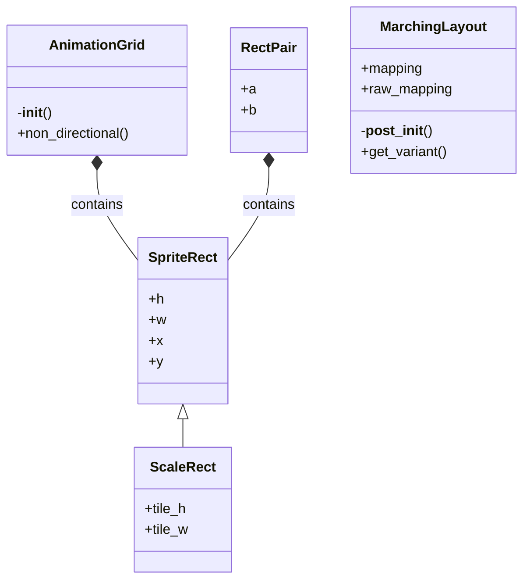

```mermaid
classDiagram
    SpriteRect <|-- ScaleRect
    AnimationGrid *-- SpriteRect : contains
    RectPair *-- SpriteRect : contains
    class SpriteRect {
        +h
        +w
        +x
        +y
    }
    class ScaleRect {
        +tile_h
        +tile_w
    }
    class RectPair {
        +a
        +b
    }
    class AnimationGrid {
        -__init__()
        +non_directional()
    }
    class MarchingLayout {
        +mapping
        +raw_mapping
        -__post_init__()
        +get_variant()
    }
```