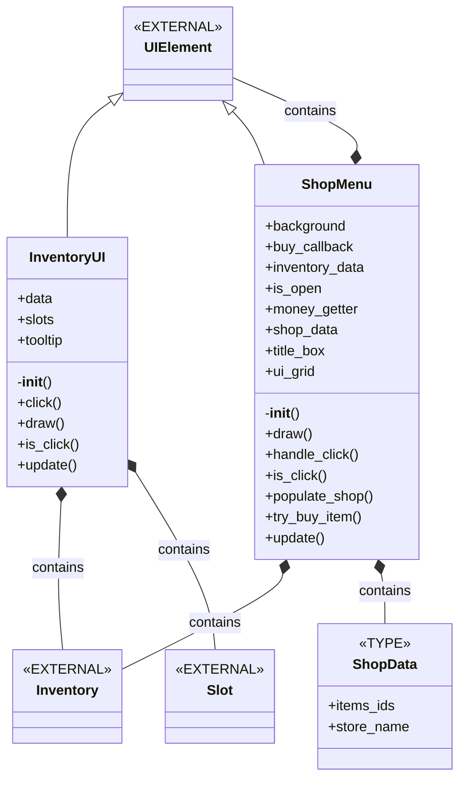

```mermaid
classDiagram
    UIElement <|-- InventoryUI
    UIElement <|-- ShopMenu
    ShopMenu *-- Inventory : contains
    ShopMenu *-- UIElement : contains
    ShopMenu *-- ShopData : contains
    InventoryUI *-- Inventory : contains
    InventoryUI *-- Slot : contains
    class Inventory {
        <<EXTERNAL>>
    }
    class ShopData {
        <<TYPE>>
        +items_ids
        +store_name
    }
    class Slot {
        <<EXTERNAL>>
    }
    class UIElement {
        <<EXTERNAL>>
    }
    class InventoryUI {
        +data
        +slots
        +tooltip
        -__init__()
        +click()
        +draw()
        +is_click()
        +update()
    }
    class ShopMenu {
        +background
        +buy_callback
        +inventory_data
        +is_open
        +money_getter
        +shop_data
        +title_box
        +ui_grid
        -__init__()
        +draw()
        +handle_click()
        +is_click()
        +populate_shop()
        +try_buy_item()
        +update()
    }
```