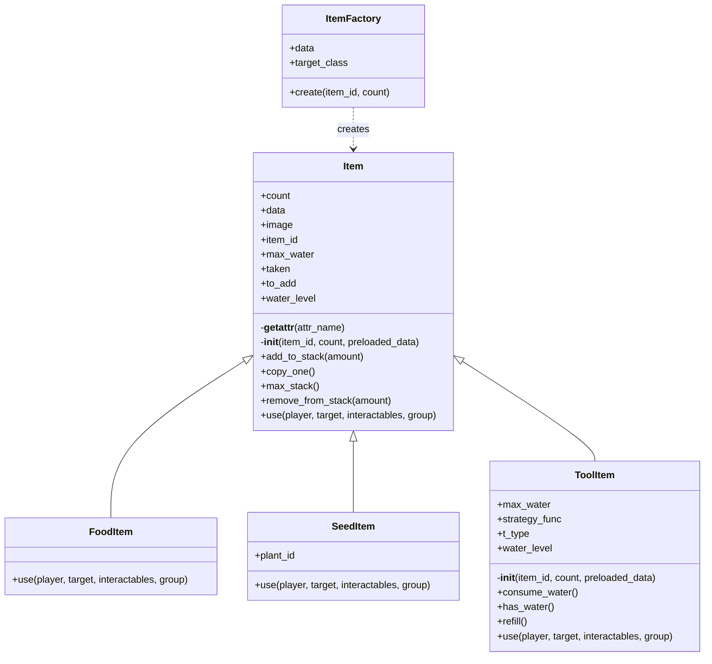

```mermaid
classDiagram
    Item <|-- FoodItem
    Item <|-- SeedItem
    Item <|-- ToolItem
    ItemFactory ..> Item : creates
    class Item {
        +count
        +data
        +image
        +item_id
        +max_water
        +taken
        +to_add
        +water_level
        -__getattr__(attr_name)
        -__init__(item_id, count, preloaded_data)
        +add_to_stack(amount)
        +copy_one()
        +max_stack()
        +remove_from_stack(amount)
        +use(player, target, interactables, group)
    }
    class FoodItem {
        +use(player, target, interactables, group)
    }
    class ItemFactory {
        +data
        +target_class
        +create(item_id, count)
    }
    class SeedItem {
        +plant_id
        +use(player, target, interactables, group)
    }
    class ToolItem {
        +max_water
        +strategy_func
        +t_type
        +water_level
        -__init__(item_id, count, preloaded_data)
        +consume_water()
        +has_water()
        +refill()
        +use(player, target, interactables, group)
    }
```