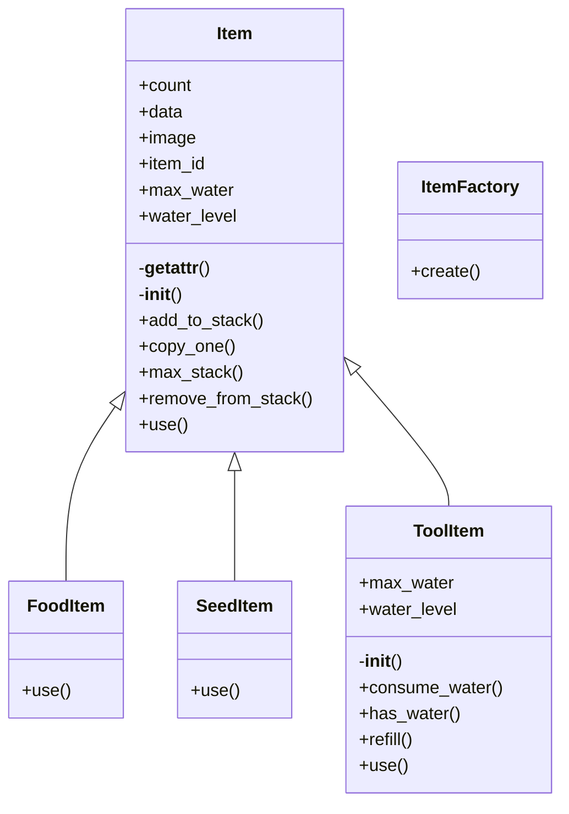

```mermaid
classDiagram
    Item <|-- FoodItem
    Item <|-- SeedItem
    Item <|-- ToolItem
    class Item {
        +count
        +data
        +image
        +item_id
        +max_water
        +water_level
        -__getattr__()
        -__init__()
        +add_to_stack()
        +copy_one()
        +max_stack()
        +remove_from_stack()
        +use()
    }
    class FoodItem {
        +use()
    }
    class ItemFactory {
        +create()
    }
    class SeedItem {
        +use()
    }
    class ToolItem {
        +max_water
        +water_level
        -__init__()
        +consume_water()
        +has_water()
        +refill()
        +use()
    }
```