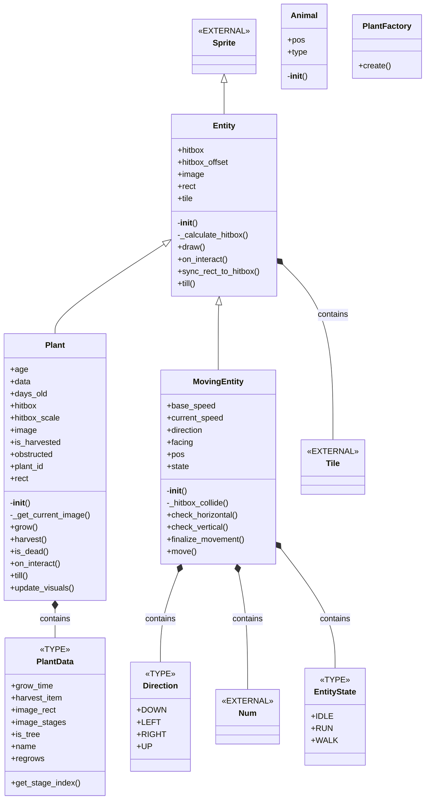

```mermaid
classDiagram
    Entity <|-- Plant
    Sprite <|-- Entity
    Entity <|-- MovingEntity
    Entity *-- Tile : contains
    MovingEntity *-- Direction : contains
    Plant *-- PlantData : contains
    MovingEntity *-- Num : contains
    MovingEntity *-- EntityState : contains
    class Direction {
        <<TYPE>>
        +DOWN
        +LEFT
        +RIGHT
        +UP
    }
    class EntityState {
        <<TYPE>>
        +IDLE
        +RUN
        +WALK
    }
    class Num {
        <<EXTERNAL>>
    }
    class PlantData {
        <<TYPE>>
        +grow_time
        +harvest_item
        +image_rect
        +image_stages
        +is_tree
        +name
        +regrows
        +get_stage_index()
    }
    class Sprite {
        <<EXTERNAL>>
    }
    class Tile {
        <<EXTERNAL>>
    }
    class Animal {
        +pos
        +type
        -__init__()
    }
    class Plant {
        +age
        +data
        +days_old
        +hitbox
        +hitbox_scale
        +image
        +is_harvested
        +obstructed
        +plant_id
        +rect
        -__init__()
        -_get_current_image()
        +grow()
        +harvest()
        +is_dead()
        +on_interact()
        +till()
        +update_visuals()
    }
    class PlantFactory {
        +create()
    }
    class Entity {
        +hitbox
        +hitbox_offset
        +image
        +rect
        +tile
        -__init__()
        -_calculate_hitbox()
        +draw()
        +on_interact()
        +sync_rect_to_hitbox()
        +till()
    }
    class MovingEntity {
        +base_speed
        +current_speed
        +direction
        +facing
        +pos
        +state
        -__init__()
        -_hitbox_collide()
        +check_horizontal()
        +check_vertical()
        +finalize_movement()
        +move()
    }
```