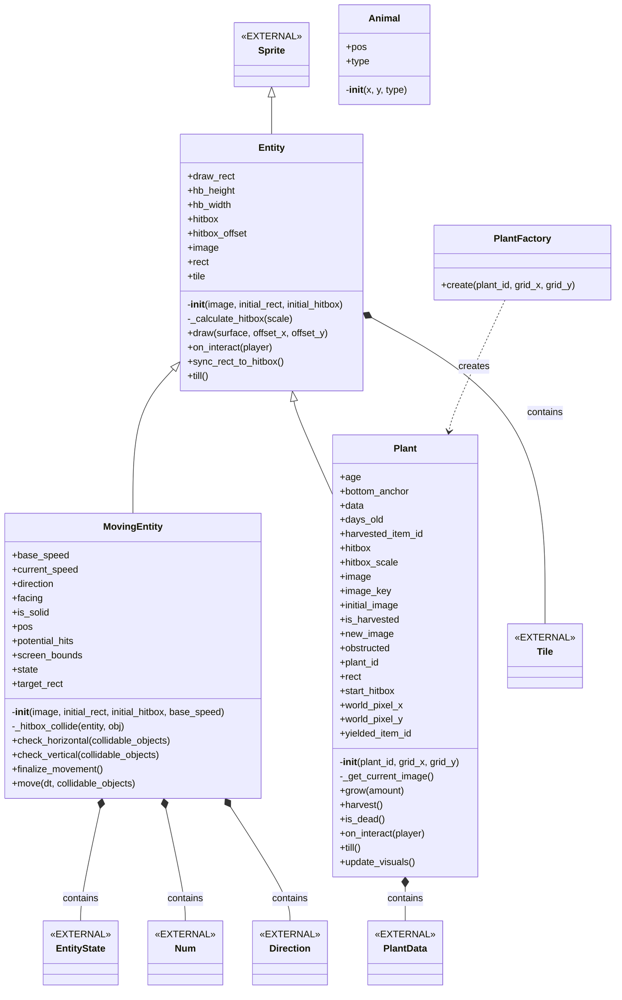

```mermaid
classDiagram
    Entity <|-- MovingEntity
    Sprite <|-- Entity
    Entity <|-- Plant
    Entity *-- Tile : contains
    Plant *-- PlantData : contains
    MovingEntity *-- EntityState : contains
    MovingEntity *-- Num : contains
    MovingEntity *-- Direction : contains
    PlantFactory ..> Plant : creates
    class Direction {
        <<EXTERNAL>>
    }
    class EntityState {
        <<EXTERNAL>>
    }
    class Num {
        <<EXTERNAL>>
    }
    class PlantData {
        <<EXTERNAL>>
    }
    class Sprite {
        <<EXTERNAL>>
    }
    class Tile {
        <<EXTERNAL>>
    }
    class MovingEntity {
        +base_speed
        +current_speed
        +direction
        +facing
        +is_solid
        +pos
        +potential_hits
        +screen_bounds
        +state
        +target_rect
        -__init__(image, initial_rect, initial_hitbox, base_speed)
        -_hitbox_collide(entity, obj)
        +check_horizontal(collidable_objects)
        +check_vertical(collidable_objects)
        +finalize_movement()
        +move(dt, collidable_objects)
    }
    class PlantFactory {
        +create(plant_id, grid_x, grid_y)
    }
    class Entity {
        +draw_rect
        +hb_height
        +hb_width
        +hitbox
        +hitbox_offset
        +image
        +rect
        +tile
        -__init__(image, initial_rect, initial_hitbox)
        -_calculate_hitbox(scale)
        +draw(surface, offset_x, offset_y)
        +on_interact(player)
        +sync_rect_to_hitbox()
        +till()
    }
    class Animal {
        +pos
        +type
        -__init__(x, y, type)
    }
    class Plant {
        +age
        +bottom_anchor
        +data
        +days_old
        +harvested_item_id
        +hitbox
        +hitbox_scale
        +image
        +image_key
        +initial_image
        +is_harvested
        +new_image
        +obstructed
        +plant_id
        +rect
        +start_hitbox
        +world_pixel_x
        +world_pixel_y
        +yielded_item_id
        -__init__(plant_id, grid_x, grid_y)
        -_get_current_image()
        +grow(amount)
        +harvest()
        +is_dead()
        +on_interact(player)
        +till()
        +update_visuals()
    }
```