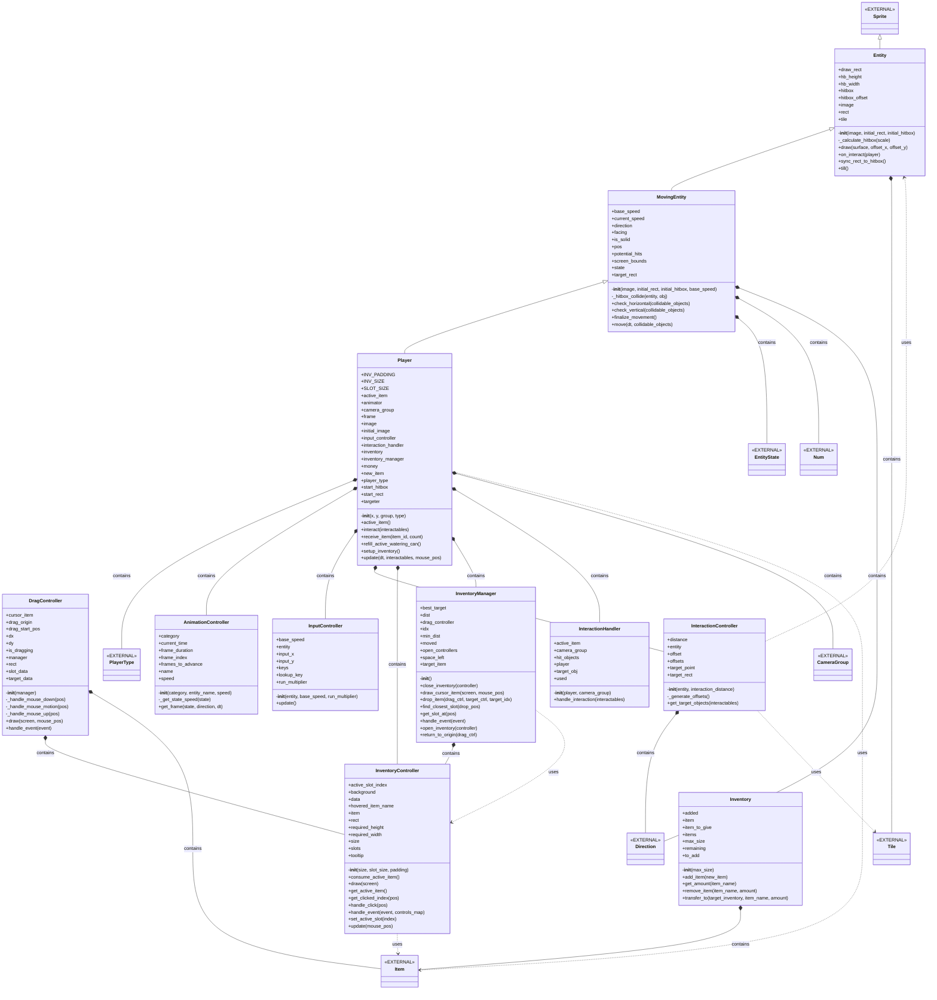

```mermaid
classDiagram
    Entity <|-- MovingEntity
    Sprite <|-- Entity
    MovingEntity <|-- Player
    DragController *-- InventoryController : contains
    DragController *-- Item : contains
    Player *-- PlayerType : contains
    Player *-- AnimationController : contains
    InteractionController *-- Direction : contains
    Entity *-- Tile : contains
    Player *-- InputController : contains
    Player *-- InteractionController : contains
    Player *-- InventoryController : contains
    Player *-- InventoryManager : contains
    MovingEntity *-- EntityState : contains
    Inventory *-- Item : contains
    Player *-- InteractionHandler : contains
    Player *-- CameraGroup : contains
    InventoryManager *-- InventoryController : contains
    MovingEntity *-- Num : contains
    MovingEntity *-- Direction : contains
    InteractionController ..> Entity : uses
    InteractionController ..> Tile : uses
    Player ..> Item : uses
    InventoryManager ..> InventoryController : uses
    InventoryController ..> Item : uses
    class CameraGroup {
        <<EXTERNAL>>
    }
    class Direction {
        <<EXTERNAL>>
    }
    class EntityState {
        <<EXTERNAL>>
    }
    class Item {
        <<EXTERNAL>>
    }
    class Num {
        <<EXTERNAL>>
    }
    class PlayerType {
        <<EXTERNAL>>
    }
    class Sprite {
        <<EXTERNAL>>
    }
    class Tile {
        <<EXTERNAL>>
    }
    class MovingEntity {
        +base_speed
        +current_speed
        +direction
        +facing
        +is_solid
        +pos
        +potential_hits
        +screen_bounds
        +state
        +target_rect
        -__init__(image, initial_rect, initial_hitbox, base_speed)
        -_hitbox_collide(entity, obj)
        +check_horizontal(collidable_objects)
        +check_vertical(collidable_objects)
        +finalize_movement()
        +move(dt, collidable_objects)
    }
    class Inventory {
        +added
        +item
        +item_to_give
        +items
        +max_size
        +remaining
        +to_add
        -__init__(max_size)
        +add_item(new_item)
        +get_amount(item_name)
        +remove_item(item_name, amount)
        +transfer_to(target_inventory, item_name, amount)
    }
    class DragController {
        +cursor_item
        +drag_origin
        +drag_start_pos
        +dx
        +dy
        +is_dragging
        +manager
        +rect
        +slot_data
        +target_data
        -__init__(manager)
        -_handle_mouse_down(pos)
        -_handle_mouse_motion(pos)
        -_handle_mouse_up(pos)
        +draw(screen, mouse_pos)
        +handle_event(event)
    }
    class InventoryManager {
        +best_target
        +dist
        +drag_controller
        +idx
        +min_dist
        +moved
        +open_controllers
        +space_left
        +target_item
        -__init__()
        +close_inventory(controller)
        +draw_cursor_item(screen, mouse_pos)
        +drop_item(drag_ctrl, target_ctrl, target_idx)
        +find_closest_slot(drop_pos)
        +get_slot_at(pos)
        +handle_event(event)
        +open_inventory(controller)
        +return_to_origin(drag_ctrl)
    }
    class Entity {
        +draw_rect
        +hb_height
        +hb_width
        +hitbox
        +hitbox_offset
        +image
        +rect
        +tile
        -__init__(image, initial_rect, initial_hitbox)
        -_calculate_hitbox(scale)
        +draw(surface, offset_x, offset_y)
        +on_interact(player)
        +sync_rect_to_hitbox()
        +till()
    }
    class InteractionController {
        +distance
        +entity
        +offset
        +offsets
        +target_point
        +target_rect
        -__init__(entity, interaction_distance)
        -_generate_offsets()
        +get_target_objects(interactables)
    }
    class AnimationController {
        +category
        +current_time
        +frame_duration
        +frame_index
        +frames_to_advance
        +name
        +speed
        -__init__(category, entity_name, speed)
        -_get_state_speed(state)
        +get_frame(state, direction, dt)
    }
    class InteractionHandler {
        +active_item
        +camera_group
        +hit_objects
        +player
        +target_obj
        +used
        -__init__(player, camera_group)
        +handle_interaction(interactables)
    }
    class Player {
        +INV_PADDING
        +INV_SIZE
        +SLOT_SIZE
        +active_item
        +animator
        +camera_group
        +frame
        +image
        +initial_image
        +input_controller
        +interaction_handler
        +inventory
        +inventory_manager
        +money
        +new_item
        +player_type
        +start_hitbox
        +start_rect
        +targeter
        -__init__(x, y, group, type)
        +active_item()
        +interact(interactables)
        +receive_item(item_id, count)
        +refill_active_watering_can()
        +setup_inventory()
        +update(dt, interactables, mouse_pos)
    }
    class InputController {
        +base_speed
        +entity
        +input_x
        +input_y
        +keys
        +lookup_key
        +run_multiplier
        -__init__(entity, base_speed, run_multiplier)
        +update()
    }
    class InventoryController {
        +active_slot_index
        +background
        +data
        +hovered_item_name
        +item
        +rect
        +required_height
        +required_width
        +size
        +slots
        +tooltip
        -__init__(size, slot_size, padding)
        +consume_active_item()
        +draw(screen)
        +get_active_item()
        +get_clicked_index(pos)
        +handle_click(pos)
        +handle_event(event, controls_map)
        +set_active_slot(index)
        +update(mouse_pos)
    }
```