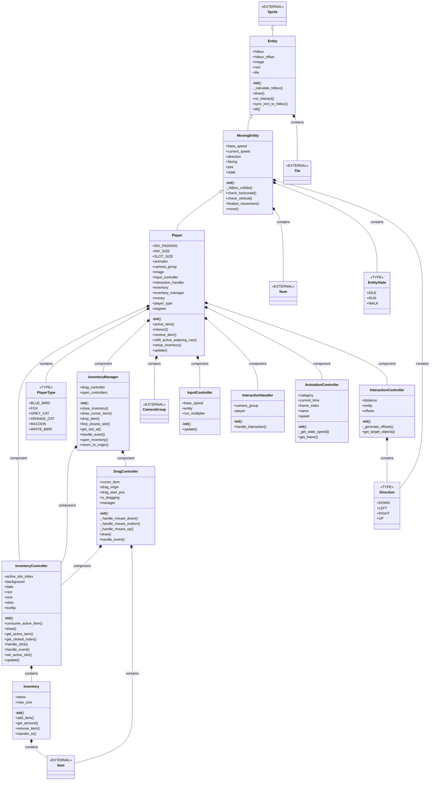

```mermaid
classDiagram
    MovingEntity <|-- Player
    Sprite <|-- Entity
    Entity <|-- MovingEntity
    InventoryController *-- Inventory : contains
    InteractionController *-- Direction : contains
    DragController *-- InventoryController : component
    DragController *-- Item : contains
    Player *-- InventoryController : component
    Player *-- PlayerType : contains
    Player *-- InventoryManager : component
    Entity *-- Tile : contains
    MovingEntity *-- Num : contains
    Player *-- CameraGroup : contains
    Player *-- InputController : component
    Player *-- InteractionHandler : component
    Inventory *-- Item : contains
    Player *-- AnimationController : component
    MovingEntity *-- EntityState : contains
    InventoryManager *-- InventoryController : component
    MovingEntity *-- Direction : contains
    InventoryManager *-- DragController : component
    Player *-- InteractionController : component
    class CameraGroup {
        <<EXTERNAL>>
    }
    class Direction {
        <<TYPE>>
        +DOWN
        +LEFT
        +RIGHT
        +UP
    }
    class EntityState {
        <<TYPE>>
        +IDLE
        +RUN
        +WALK
    }
    class Item {
        <<EXTERNAL>>
    }
    class Num {
        <<EXTERNAL>>
    }
    class PlayerType {
        <<TYPE>>
        +BLUE_BIRD
        +FOX
        +GREY_CAT
        +ORANGE_CAT
        +RACOON
        +WHITE_BIRD
    }
    class Sprite {
        <<EXTERNAL>>
    }
    class Tile {
        <<EXTERNAL>>
    }
    class Player {
        +INV_PADDING
        +INV_SIZE
        +SLOT_SIZE
        +animator
        +camera_group
        +image
        +input_controller
        +interaction_handler
        +inventory
        +inventory_manager
        +money
        +player_type
        +targeter
        -__init__()
        +active_item()
        +interact()
        +receive_item()
        +refill_active_watering_can()
        +setup_inventory()
        +update()
    }
    class AnimationController {
        +category
        +current_time
        +frame_index
        +name
        +speed
        -__init__()
        -_get_state_speed()
        +get_frame()
    }
    class InputController {
        +base_speed
        +entity
        +run_multiplier
        -__init__()
        +update()
    }
    class InteractionController {
        +distance
        +entity
        +offsets
        -__init__()
        -_generate_offsets()
        +get_target_objects()
    }
    class InteractionHandler {
        +camera_group
        +player
        -__init__()
        +handle_interaction()
    }
    class DragController {
        +cursor_item
        +drag_origin
        +drag_start_pos
        +is_dragging
        +manager
        -__init__()
        -_handle_mouse_down()
        -_handle_mouse_motion()
        -_handle_mouse_up()
        +draw()
        +handle_event()
    }
    class InventoryController {
        +active_slot_index
        +background
        +data
        +rect
        +size
        +slots
        +tooltip
        -__init__()
        +consume_active_item()
        +draw()
        +get_active_item()
        +get_clicked_index()
        +handle_click()
        +handle_event()
        +set_active_slot()
        +update()
    }
    class Inventory {
        +items
        +max_size
        -__init__()
        +add_item()
        +get_amount()
        +remove_item()
        +transfer_to()
    }
    class InventoryManager {
        +drag_controller
        +open_controllers
        -__init__()
        +close_inventory()
        +draw_cursor_item()
        +drop_item()
        +find_closest_slot()
        +get_slot_at()
        +handle_event()
        +open_inventory()
        +return_to_origin()
    }
    class Entity {
        +hitbox
        +hitbox_offset
        +image
        +rect
        +tile
        -__init__()
        -_calculate_hitbox()
        +draw()
        +on_interact()
        +sync_rect_to_hitbox()
        +till()
    }
    class MovingEntity {
        +base_speed
        +current_speed
        +direction
        +facing
        +pos
        +state
        -__init__()
        -_hitbox_collide()
        +check_horizontal()
        +check_vertical()
        +finalize_movement()
        +move()
    }
```