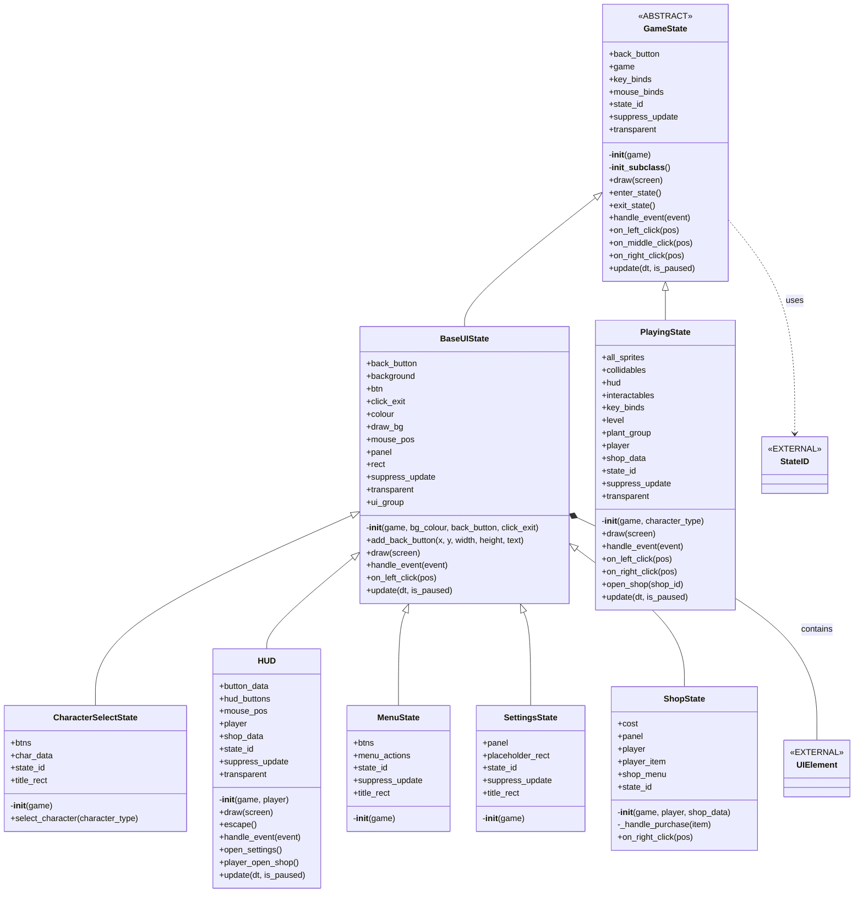

```mermaid
classDiagram
    GameState <|-- BaseUIState
    BaseUIState <|-- CharacterSelectState
    BaseUIState <|-- HUD
    BaseUIState <|-- MenuState
    GameState <|-- PlayingState
    BaseUIState <|-- SettingsState
    BaseUIState <|-- ShopState
    BaseUIState *-- UIElement : contains
    GameState ..> StateID : uses
    class StateID {
        <<EXTERNAL>>
    }
    class UIElement {
        <<EXTERNAL>>
    }
    class BaseUIState {
        +back_button
        +background
        +btn
        +click_exit
        +colour
        +draw_bg
        +mouse_pos
        +panel
        +rect
        +suppress_update
        +transparent
        +ui_group
        -__init__(game, bg_colour, back_button, click_exit)
        +add_back_button(x, y, width, height, text)
        +draw(screen)
        +handle_event(event)
        +on_left_click(pos)
        +update(dt, is_paused)
    }
    class CharacterSelectState {
        +btns
        +char_data
        +state_id
        +title_rect
        -__init__(game)
        +select_character(character_type)
    }
    class GameState {
        <<ABSTRACT>>
        +back_button
        +game
        +key_binds
        +mouse_binds
        +state_id
        +suppress_update
        +transparent
        -__init__(game)
        -__init_subclass__()
        +draw(screen)
        +enter_state()
        +exit_state()
        +handle_event(event)
        +on_left_click(pos)
        +on_middle_click(pos)
        +on_right_click(pos)
        +update(dt, is_paused)
    }
    class HUD {
        +button_data
        +hud_buttons
        +mouse_pos
        +player
        +shop_data
        +state_id
        +suppress_update
        +transparent
        -__init__(game, player)
        +draw(screen)
        +escape()
        +handle_event(event)
        +open_settings()
        +player_open_shop()
        +update(dt, is_paused)
    }
    class MenuState {
        +btns
        +menu_actions
        +state_id
        +suppress_update
        +title_rect
        -__init__(game)
    }
    class PlayingState {
        +all_sprites
        +collidables
        +hud
        +interactables
        +key_binds
        +level
        +plant_group
        +player
        +shop_data
        +state_id
        +suppress_update
        +transparent
        -__init__(game, character_type)
        +draw(screen)
        +handle_event(event)
        +on_left_click(pos)
        +on_right_click(pos)
        +open_shop(shop_id)
        +update(dt, is_paused)
    }
    class SettingsState {
        +panel
        +placeholder_rect
        +state_id
        +suppress_update
        +title_rect
        -__init__(game)
    }
    class ShopState {
        +cost
        +panel
        +player
        +player_item
        +shop_menu
        +state_id
        -__init__(game, player, shop_data)
        -_handle_purchase(item)
        +on_right_click(pos)
    }
```