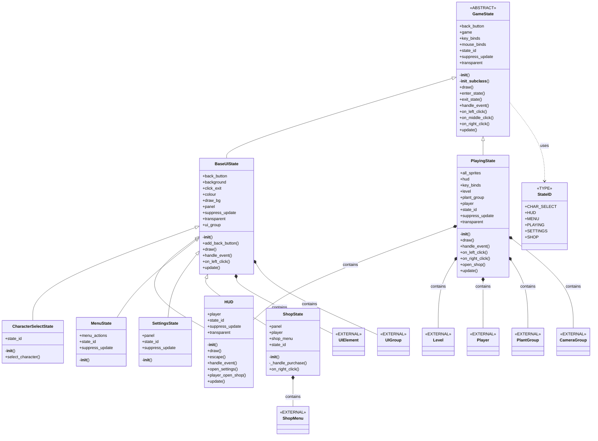

```mermaid
classDiagram
    GameState <|-- BaseUIState
    BaseUIState <|-- CharacterSelectState
    BaseUIState <|-- HUD
    BaseUIState <|-- MenuState
    GameState <|-- PlayingState
    BaseUIState <|-- SettingsState
    BaseUIState <|-- ShopState
    PlayingState *-- HUD : contains
    BaseUIState *-- UIElement : contains
    PlayingState *-- Level : contains
    PlayingState *-- Player : contains
    ShopState *-- ShopMenu : contains
    PlayingState *-- PlantGroup : contains
    PlayingState *-- CameraGroup : contains
    BaseUIState *-- UIGroup : contains
    GameState ..> StateID : uses
    class CameraGroup {
        <<EXTERNAL>>
    }
    class Level {
        <<EXTERNAL>>
    }
    class PlantGroup {
        <<EXTERNAL>>
    }
    class Player {
        <<EXTERNAL>>
    }
    class ShopMenu {
        <<EXTERNAL>>
    }
    class StateID {
        <<TYPE>>
        +CHAR_SELECT
        +HUD
        +MENU
        +PLAYING
        +SETTINGS
        +SHOP
    }
    class UIElement {
        <<EXTERNAL>>
    }
    class UIGroup {
        <<EXTERNAL>>
    }
    class BaseUIState {
        +back_button
        +background
        +click_exit
        +colour
        +draw_bg
        +panel
        +suppress_update
        +transparent
        +ui_group
        -__init__()
        +add_back_button()
        +draw()
        +handle_event()
        +on_left_click()
        +update()
    }
    class CharacterSelectState {
        +state_id
        -__init__()
        +select_character()
    }
    class GameState {
        <<ABSTRACT>>
        +back_button
        +game
        +key_binds
        +mouse_binds
        +state_id
        +suppress_update
        +transparent
        -__init__()
        -__init_subclass__()
        +draw()
        +enter_state()
        +exit_state()
        +handle_event()
        +on_left_click()
        +on_middle_click()
        +on_right_click()
        +update()
    }
    class HUD {
        +player
        +state_id
        +suppress_update
        +transparent
        -__init__()
        +draw()
        +escape()
        +handle_event()
        +open_settings()
        +player_open_shop()
        +update()
    }
    class MenuState {
        +menu_actions
        +state_id
        +suppress_update
        -__init__()
    }
    class PlayingState {
        +all_sprites
        +hud
        +key_binds
        +level
        +plant_group
        +player
        +state_id
        +suppress_update
        +transparent
        -__init__()
        +draw()
        +handle_event()
        +on_left_click()
        +on_right_click()
        +open_shop()
        +update()
    }
    class SettingsState {
        +panel
        +state_id
        +suppress_update
        -__init__()
    }
    class ShopState {
        +panel
        +player
        +shop_menu
        +state_id
        -__init__()
        -_handle_purchase()
        +on_right_click()
    }
```