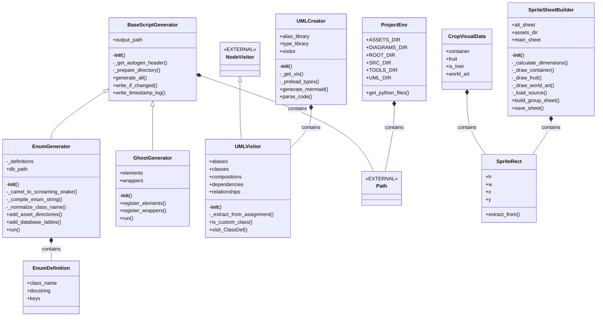

```mermaid
classDiagram
    BaseScriptGenerator <|-- EnumGenerator
    BaseScriptGenerator <|-- GhostGenerator
    NodeVisitor <|-- UMLVisitor
    EnumGenerator *-- EnumDefinition : contains
    UMLCreator *-- UMLVisitor : contains
    BaseScriptGenerator *-- Path : contains
    CropVisualData *-- SpriteRect : contains
    ProjectEnv *-- Path : contains
    SpriteSheetBuilder *-- SpriteRect : contains
    class NodeVisitor {
        <<EXTERNAL>>
    }
    class Path {
        <<EXTERNAL>>
    }
    class BaseScriptGenerator {
        +output_path
        -__init__()
        -_get_autogen_header()
        -_prepare_directory()
        +generate_all()
        +write_if_changed()
        +write_timestamp_log()
    }
    class SpriteRect {
        +h
        +w
        +x
        +y
        +extract_from()
    }
    class CropVisualData {
        +container
        +fruit
        +is_tree
        +world_art
    }
    class SpriteSheetBuilder {
        +alt_sheet
        +assets_dir
        +main_sheet
        -__init__()
        -_calculate_dimensions()
        -_draw_container()
        -_draw_fruit()
        -_draw_world_art()
        -_load_source()
        +build_group_sheet()
        +save_sheet()
    }
    class EnumDefinition {
        +class_name
        +docstring
        +keys
    }
    class EnumGenerator {
        -_definitions
        +db_path
        -__init__()
        -_camel_to_screaming_snake()
        -_compile_enum_string()
        -_normalize_class_name()
        +add_asset_directories()
        +add_database_tables()
        +run()
    }
    class GhostGenerator {
        +elements
        +wrappers
        -__init__()
        +register_elements()
        +register_wrappers()
        +run()
    }
    class UMLVisitor {
        +aliases
        +classes
        +compositions
        +dependencies
        +relationships
        -__init__()
        -_extract_from_assignment()
        +is_custom_class()
        +visit_ClassDef()
    }
    class UMLCreator {
        +alias_library
        +type_library
        +visitor
        -__init__()
        -_get_vis()
        -_preload_types()
        +generate_mermaid()
        +parse_code()
    }
    class ProjectEnv {
        +ASSETS_DIR
        +DIAGRAMS_DIR
        +ROOT_DIR
        +SRC_DIR
        +TOOLS_DIR
        +UML_DIR
        +get_python_files()
    }
```