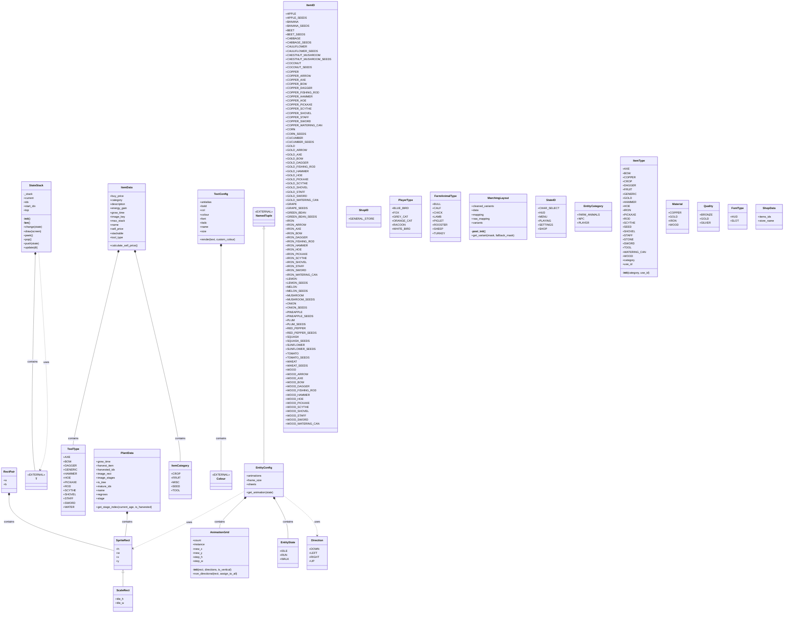

```mermaid
classDiagram
    SpriteRect <|-- ScaleRect
    NamedTuple <|-- EntityConfig
    EntityConfig *-- AnimationGrid : contains
    StateStack *-- T : contains
    ItemData *-- ToolType : contains
    EntityConfig *-- EntityState : contains
    RectPair *-- SpriteRect : contains
    ItemData *-- ItemCategory : contains
    TextConfig *-- Colour : contains
    PlantData *-- SpriteRect : contains
    EntityConfig ..> SpriteRect : uses
    EntityConfig ..> Direction : uses
    StateStack ..> T : uses
    class Colour {
        <<EXTERNAL>>
    }
    class NamedTuple {
        <<EXTERNAL>>
    }
    class T {
        <<EXTERNAL>>
    }
    class ItemID {
        +APPLE
        +APPLE_SEEDS
        +BANANA
        +BANANA_SEEDS
        +BEET
        +BEET_SEEDS
        +CABBAGE
        +CABBAGE_SEEDS
        +CAULIFLOWER
        +CAULIFLOWER_SEEDS
        +CHESTNUT_MUSHROOM
        +CHESTNUT_MUSHROOM_SEEDS
        +COCONUT
        +COCONUT_SEEDS
        +COPPER
        +COPPER_ARROW
        +COPPER_AXE
        +COPPER_BOW
        +COPPER_DAGGER
        +COPPER_FISHING_ROD
        +COPPER_HAMMER
        +COPPER_HOE
        +COPPER_PICKAXE
        +COPPER_SCYTHE
        +COPPER_SHOVEL
        +COPPER_STAFF
        +COPPER_SWORD
        +COPPER_WATERING_CAN
        +CORN
        +CORN_SEEDS
        +CUCUMBER
        +CUCUMBER_SEEDS
        +GOLD
        +GOLD_ARROW
        +GOLD_AXE
        +GOLD_BOW
        +GOLD_DAGGER
        +GOLD_FISHING_ROD
        +GOLD_HAMMER
        +GOLD_HOE
        +GOLD_PICKAXE
        +GOLD_SCYTHE
        +GOLD_SHOVEL
        +GOLD_STAFF
        +GOLD_SWORD
        +GOLD_WATERING_CAN
        +GRAPE
        +GRAPE_SEEDS
        +GREEN_BEAN
        +GREEN_BEAN_SEEDS
        +IRON
        +IRON_ARROW
        +IRON_AXE
        +IRON_BOW
        +IRON_DAGGER
        +IRON_FISHING_ROD
        +IRON_HAMMER
        +IRON_HOE
        +IRON_PICKAXE
        +IRON_SCYTHE
        +IRON_SHOVEL
        +IRON_STAFF
        +IRON_SWORD
        +IRON_WATERING_CAN
        +LEMON
        +LEMON_SEEDS
        +MELON
        +MELON_SEEDS
        +MUSHROOM
        +MUSHROOM_SEEDS
        +ONION
        +ONION_SEEDS
        +PINEAPPLE
        +PINEAPPLE_SEEDS
        +PLUM
        +PLUM_SEEDS
        +RED_PEPPER
        +RED_PEPPER_SEEDS
        +SQUASH
        +SQUASH_SEEDS
        +SUNFLOWER
        +SUNFLOWER_SEEDS
        +TOMATO
        +TOMATO_SEEDS
        +WHEAT
        +WHEAT_SEEDS
        +WOOD
        +WOOD_ARROW
        +WOOD_AXE
        +WOOD_BOW
        +WOOD_DAGGER
        +WOOD_FISHING_ROD
        +WOOD_HAMMER
        +WOOD_HOE
        +WOOD_PICKAXE
        +WOOD_SCYTHE
        +WOOD_SHOVEL
        +WOOD_STAFF
        +WOOD_SWORD
        +WOOD_WATERING_CAN
    }
    class ShopID {
        +GENERAL_STORE
    }
    class PlayerType {
        +BLUE_BIRD
        +FOX
        +GREY_CAT
        +ORANGE_CAT
        +RACOON
        +WHITE_BIRD
    }
    class FarmAnimalType {
        +BULL
        +CALF
        +CHICK
        +LAMB
        +PIGLET
        +ROOSTER
        +SHEEP
        +TURKEY
    }
    class SpriteRect {
        +h
        +w
        +x
        +y
    }
    class ScaleRect {
        +tile_h
        +tile_w
    }
    class RectPair {
        +a
        +b
    }
    class AnimationGrid {
        +count
        +instance
        +new_x
        +new_y
        +step_h
        +step_w
        -__init__(rect, directions, is_vertical)
        +non_directional(rect, assign_to_all)
    }
    class MarchingLayout {
        +cleaned_variants
        +data
        +mapping
        +raw_mapping
        +variants
        -__post_init__()
        +get_variant(mask, fallback_mask)
    }
    class StateID {
        +CHAR_SELECT
        +HUD
        +MENU
        +PLAYING
        +SETTINGS
        +SHOP
    }
    class EntityState {
        +IDLE
        +RUN
        +WALK
    }
    class Direction {
        +DOWN
        +LEFT
        +RIGHT
        +UP
    }
    class EntityCategory {
        +FARM_ANIMALS
        +NPC
        +PLAYER
    }
    class ItemType {
        +AXE
        +BOW
        +COPPER
        +CROP
        +DAGGER
        +FRUIT
        +GENERIC
        +GOLD
        +HAMMER
        +HOE
        +IRON
        +PICKAXE
        +ROD
        +SCYTHE
        +SEED
        +SHOVEL
        +STAFF
        +STONE
        +SWORD
        +TOOL
        +WATERING_CAN
        +WOOD
        +category
        +use_id
        -__init__(category, use_id)
    }
    class ItemCategory {
        +CROP
        +FRUIT
        +MISC
        +SEED
        +TOOL
    }
    class ToolType {
        +AXE
        +BOW
        +DAGGER
        +GENERIC
        +HAMMER
        +HOE
        +PICKAXE
        +ROD
        +SCYTHE
        +SHOVEL
        +STAFF
        +SWORD
        +WATER
    }
    class Material {
        +COPPER
        +GOLD
        +IRON
        +WOOD
    }
    class Quality {
        +BRONZE
        +GOLD
        +SILVER
    }
    class FontType {
        +HUD
        +SLOT
    }
    class EntityConfig {
        +animations
        +frame_size
        +sheets
        +get_animation(state)
    }
    class ItemData {
        +buy_price
        +category
        +description
        +energy_gain
        +grow_time
        +image_key
        +max_stack
        +name
        +sell_price
        +stackable
        +tool_type
        +calculate_sell_price()
    }
    class PlantData {
        +grow_time
        +harvest_item
        +harvested_idx
        +image_rect
        +image_stages
        +is_tree
        +mature_idx
        +name
        +regrows
        +stage
        +get_stage_index(current_age, is_harvested)
    }
    class ShopData {
        +items_ids
        +store_name
    }
    class TextConfig {
        +antialias
        +bold
        +col
        +colour
        +font
        +italic
        +name
        +size
        +render(text, custom_colour)
    }
    class StateStack {
        -_stack
        +current
        +idx
        +start_idx
        +top
        -__init__()
        -__len__()
        +change(state)
        +draw(screen)
        +peek()
        +pop()
        +push(state)
        +update(dt)
    }
```