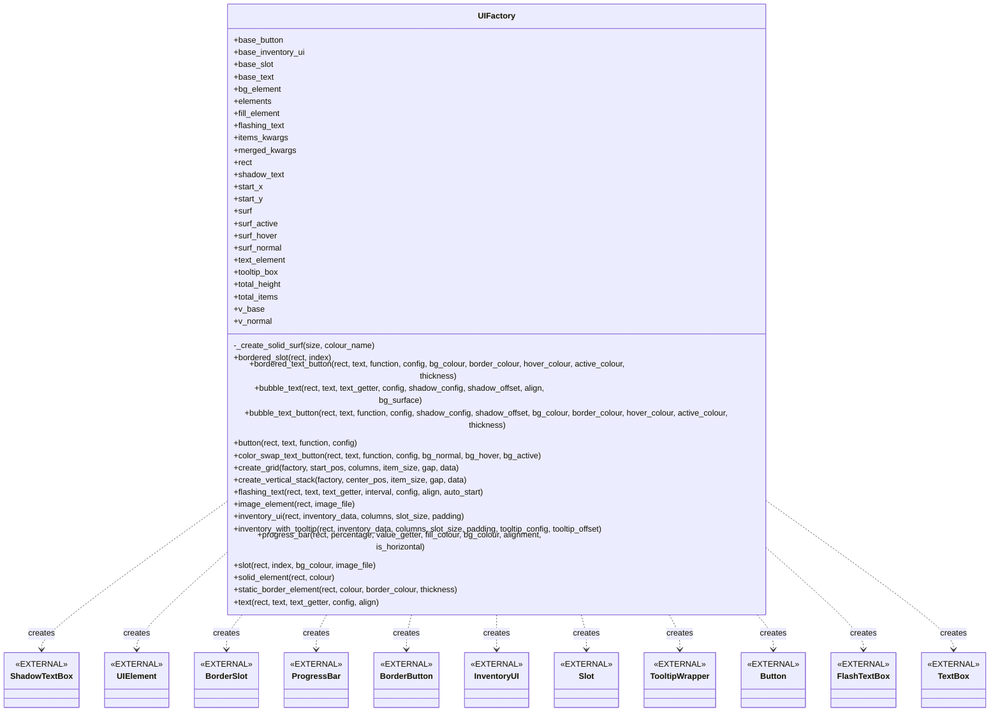

```mermaid
classDiagram
    UIFactory ..> ShadowTextBox : creates
    UIFactory ..> UIElement : creates
    UIFactory ..> BorderSlot : creates
    UIFactory ..> ProgressBar : creates
    UIFactory ..> BorderButton : creates
    UIFactory ..> InventoryUI : creates
    UIFactory ..> Slot : creates
    UIFactory ..> TooltipWrapper : creates
    UIFactory ..> Button : creates
    UIFactory ..> FlashTextBox : creates
    UIFactory ..> TextBox : creates
    class BorderButton {
        <<EXTERNAL>>
    }
    class BorderSlot {
        <<EXTERNAL>>
    }
    class Button {
        <<EXTERNAL>>
    }
    class FlashTextBox {
        <<EXTERNAL>>
    }
    class InventoryUI {
        <<EXTERNAL>>
    }
    class ProgressBar {
        <<EXTERNAL>>
    }
    class ShadowTextBox {
        <<EXTERNAL>>
    }
    class Slot {
        <<EXTERNAL>>
    }
    class TextBox {
        <<EXTERNAL>>
    }
    class TooltipWrapper {
        <<EXTERNAL>>
    }
    class UIElement {
        <<EXTERNAL>>
    }
    class UIFactory {
        +base_button
        +base_inventory_ui
        +base_slot
        +base_text
        +bg_element
        +elements
        +fill_element
        +flashing_text
        +items_kwargs
        +merged_kwargs
        +rect
        +shadow_text
        +start_x
        +start_y
        +surf
        +surf_active
        +surf_hover
        +surf_normal
        +text_element
        +tooltip_box
        +total_height
        +total_items
        +v_base
        +v_normal
        -_create_solid_surf(size, colour_name)
        +bordered_slot(rect, index)
        +bordered_text_button(rect, text, function, config, bg_colour, border_colour, hover_colour, active_colour, thickness)
        +bubble_text(rect, text, text_getter, config, shadow_config, shadow_offset, align, bg_surface)
        +bubble_text_button(rect, text, function, config, shadow_config, shadow_offset, bg_colour, border_colour, hover_colour, active_colour, thickness)
        +button(rect, text, function, config)
        +color_swap_text_button(rect, text, function, config, bg_normal, bg_hover, bg_active)
        +create_grid(factory, start_pos, columns, item_size, gap, data)
        +create_vertical_stack(factory, center_pos, item_size, gap, data)
        +flashing_text(rect, text, text_getter, interval, config, align, auto_start)
        +image_element(rect, image_file)
        +inventory_ui(rect, inventory_data, columns, slot_size, padding)
        +inventory_with_tooltip(rect, inventory_data, columns, slot_size, padding, tooltip_config, tooltip_offset)
        +progress_bar(rect, percentage, value_getter, fill_colour, bg_colour, alignment, is_horizontal)
        +slot(rect, index, bg_colour, image_file)
        +solid_element(rect, colour)
        +static_border_element(rect, colour, border_colour, thickness)
        +text(rect, text, text_getter, config, align)
    }
```