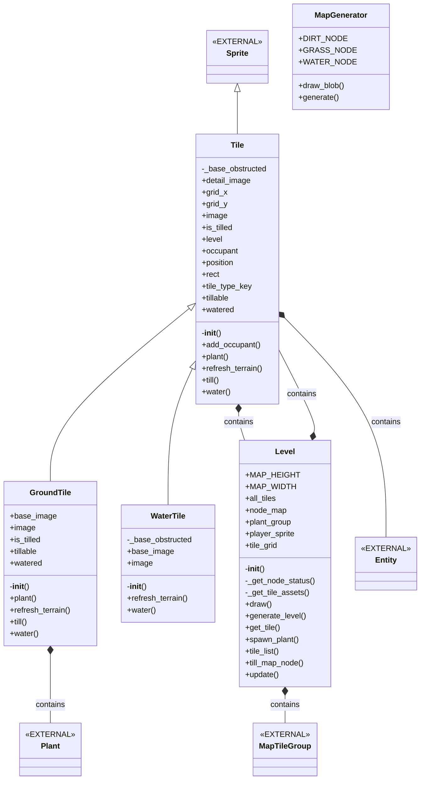

```mermaid
classDiagram
    Sprite <|-- Tile
    Tile <|-- GroundTile
    Tile <|-- WaterTile
    Level *-- Tile : contains
    Tile *-- Entity : contains
    Level *-- MapTileGroup : contains
    Tile *-- Level : contains
    GroundTile *-- Plant : contains
    class Entity {
        <<EXTERNAL>>
    }
    class MapTileGroup {
        <<EXTERNAL>>
    }
    class Plant {
        <<EXTERNAL>>
    }
    class Sprite {
        <<EXTERNAL>>
    }
    class Level {
        +MAP_HEIGHT
        +MAP_WIDTH
        +all_tiles
        +node_map
        +plant_group
        +player_sprite
        +tile_grid
        -__init__()
        -_get_node_status()
        -_get_tile_assets()
        +draw()
        +generate_level()
        +get_tile()
        +spawn_plant()
        +tile_list()
        +till_map_node()
        +update()
    }
    class MapGenerator {
        +DIRT_NODE
        +GRASS_NODE
        +WATER_NODE
        +draw_blob()
        +generate()
    }
    class Tile {
        -_base_obstructed
        +detail_image
        +grid_x
        +grid_y
        +image
        +is_tilled
        +level
        +occupant
        +position
        +rect
        +tile_type_key
        +tillable
        +watered
        -__init__()
        +add_occupant()
        +plant()
        +refresh_terrain()
        +till()
        +water()
    }
    class GroundTile {
        +base_image
        +image
        +is_tilled
        +tillable
        +watered
        -__init__()
        +plant()
        +refresh_terrain()
        +till()
        +water()
    }
    class WaterTile {
        -_base_obstructed
        +base_image
        +image
        -__init__()
        +refresh_terrain()
        +water()
    }
```