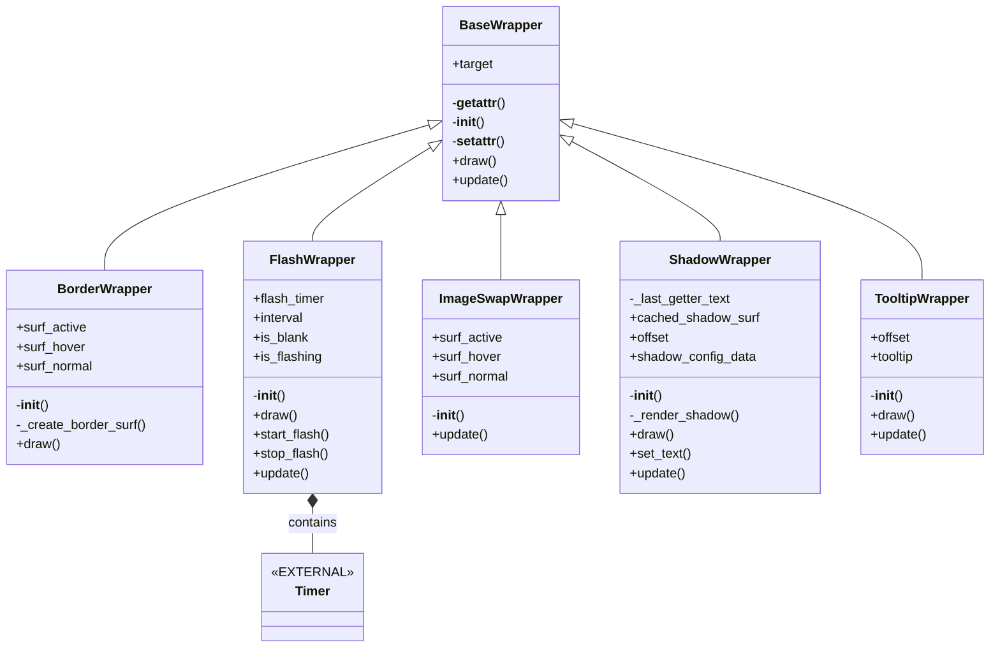

```mermaid
classDiagram
    BaseWrapper <|-- BorderWrapper
    BaseWrapper <|-- FlashWrapper
    BaseWrapper <|-- ImageSwapWrapper
    BaseWrapper <|-- ShadowWrapper
    BaseWrapper <|-- TooltipWrapper
    FlashWrapper *-- Timer : contains
    class Timer {
        <<EXTERNAL>>
    }
    class BaseWrapper {
        +target
        -__getattr__()
        -__init__()
        -__setattr__()
        +draw()
        +update()
    }
    class BorderWrapper {
        +surf_active
        +surf_hover
        +surf_normal
        -__init__()
        -_create_border_surf()
        +draw()
    }
    class FlashWrapper {
        +flash_timer
        +interval
        +is_blank
        +is_flashing
        -__init__()
        +draw()
        +start_flash()
        +stop_flash()
        +update()
    }
    class ImageSwapWrapper {
        +surf_active
        +surf_hover
        +surf_normal
        -__init__()
        +update()
    }
    class ShadowWrapper {
        -_last_getter_text
        +cached_shadow_surf
        +offset
        +shadow_config_data
        -__init__()
        -_render_shadow()
        +draw()
        +set_text()
        +update()
    }
    class TooltipWrapper {
        +offset
        +tooltip
        -__init__()
        +draw()
        +update()
    }
```