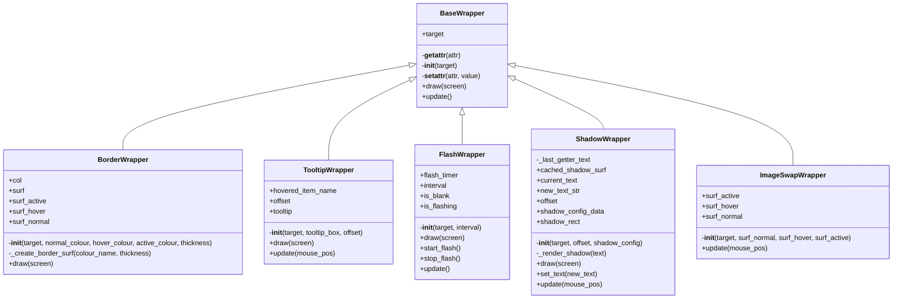

```mermaid
classDiagram
    BaseWrapper <|-- BorderWrapper
    BaseWrapper <|-- TooltipWrapper
    BaseWrapper <|-- FlashWrapper
    BaseWrapper <|-- ShadowWrapper
    BaseWrapper <|-- ImageSwapWrapper
    class BorderWrapper {
        +col
        +surf
        +surf_active
        +surf_hover
        +surf_normal
        -__init__(target, normal_colour, hover_colour, active_colour, thickness)
        -_create_border_surf(colour_name, thickness)
        +draw(screen)
    }
    class TooltipWrapper {
        +hovered_item_name
        +offset
        +tooltip
        -__init__(target, tooltip_box, offset)
        +draw(screen)
        +update(mouse_pos)
    }
    class FlashWrapper {
        +flash_timer
        +interval
        +is_blank
        +is_flashing
        -__init__(target, interval)
        +draw(screen)
        +start_flash()
        +stop_flash()
        +update()
    }
    class ShadowWrapper {
        -_last_getter_text
        +cached_shadow_surf
        +current_text
        +new_text_str
        +offset
        +shadow_config_data
        +shadow_rect
        -__init__(target, offset, shadow_config)
        -_render_shadow(text)
        +draw(screen)
        +set_text(new_text)
        +update(mouse_pos)
    }
    class BaseWrapper {
        +target
        -__getattr__(attr)
        -__init__(target)
        -__setattr__(attr, value)
        +draw(screen)
        +update()
    }
    class ImageSwapWrapper {
        +surf_active
        +surf_hover
        +surf_normal
        -__init__(target, surf_normal, surf_hover, surf_active)
        +update(mouse_pos)
    }
```